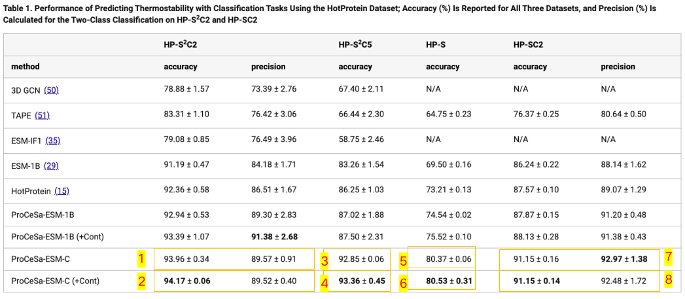
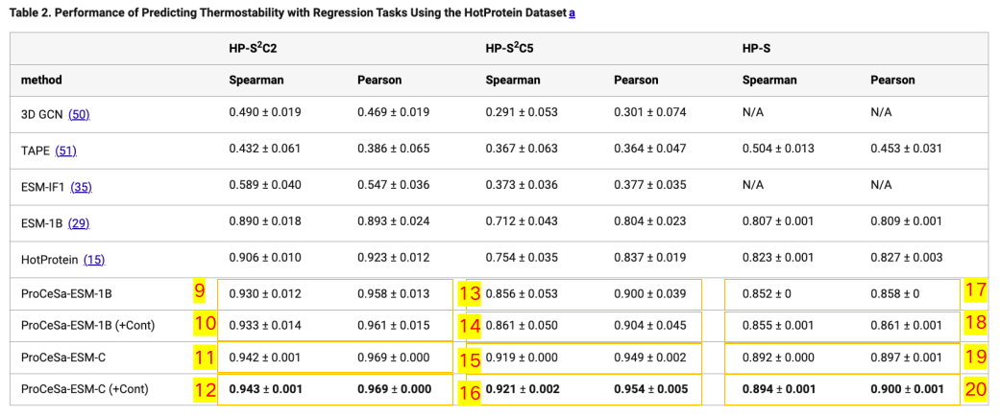
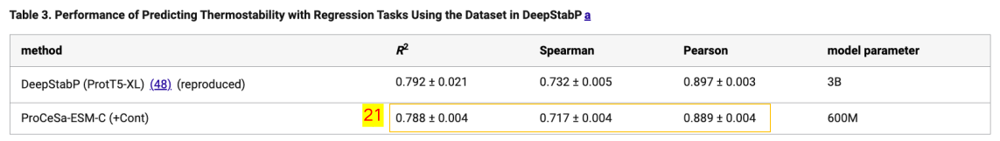

# ProCeSa
This is the source code of "ProCeSa: Contrast-Enhanced Structure-Aware Network for Thermostability Prediction with Protein Language Models" (https://doi.org/10.1021/acs.jcim.4c01752).

## conda environment
`/procesa/environment.yml`

## esm model
Download pretrained ESM1B-650M, ESMC-600M model from original github. Put these models in `/dwnl_ckpts`.

## data generation

1. Download the 'procesa_data.zip' (https://drive.google.com/file/d/1gYO1l_HJugmDxAa1JOdKnuojYqaF15Ur/view?usp=sharing), uncompress it, and put the folder in `/dataset`. It should look like `/dataset/procesa_data/...`

2. Use scripts in `/procesa/FLIP/baselines/scripts/` to generate dgl graph pkl files. Generated data will be saved in `/datasets`.


## Train and evaluate
Run scripts in `/procesa/scripts` to train and evaluate models. Results will be saved in `/procesa/results/`. The correspondence between results shown in paper and running scripts are shown in figure below.




| index | config path| script path |
| - | - | - |
|1|`procesa/configs/s2c2_esmc_cls/model1.py`|`procesa/scripts/s2c2_esmc_cls/s2c2_esmc-cls-model1.sh` |
|2|`procesa/configs/s2c2_esmc_cls/model2.py`| `procesa/scripts/s2c2_esmc_cls/s2c2_esmc-cls-model2.sh` |
|3|`procesa/configs/s2c5_esmc_cls/model1.py`|`procesa/scripts/s2c5_esmc_cls/s2c5_esmc-cls-model1.sh` |
|4|`procesa/configs/s2c5_esmc_cls/model3.py`|`procesa/scripts/s2c5_esmc_cls/s2c5_esmc-cls-model3.sh` |
|5|`procesa/configs/S_esmc_cls/model1.py`|`procesa/scripts/S_esmc_cls/S_esmc-cls-model1.sh` |
|6|`procesa/configs/S_esmc_cls/model0.py`|`procesa/scripts/S_esmc_cls/S_esmc-cls-model0.sh` |
|7|`procesa/configs/SC2_esmc_cls/model1.py`|`procesa/scripts/SC2_esmc_cls/SC2_esmc-cls-model1.sh` |
|8|`procesa/configs/SC2_esmc_cls/model2.py`|`procesa/scripts/SC2_esmc_cls/SC2_esmc-cls-model2.sh` |
|9|`procesa/configs/s2c2_esm1b/model112.py`|`procesa/scripts/s2c2_esm1b/slurm-esm1b-s2c2-model112.sh` |
|10|`procesa/configs/s2c2_esm1b/model90.py`|`procesa/scripts/s2c2_esm1b/slurm-esm1b-s2c2-model90.sh` |
|11|`procesa/configs/s2c2_esmc/model1.py`|`procesa/scripts/s2c2_esmc/s2c2_esmc-model1.sh` |
|12|`procesa/configs/s2c2_esmc/model3.py`|`procesa/scripts/s2c2_esmc/s2c2_esmc-model3.sh`|
|13|`procesa/configs/s2c5_esm1b/model104.py`| `procesa/scripts/s2c5_esm1b/slurm-esm1b-s2c5-model104.sh`|
|14|`procesa/configs/s2c5_esm1b/model89.py`|`procesa/scripts/s2c5_esm1b/slurm-esm1b-s2c5-model89.sh`|
|15|`procesa/configs/s2c5_esmc/model1.py`|`procesa/scripts/s2c5_esmc/s2c5_esmc-model1.sh` |
|16|`procesa/configs/s2c5_esmc/model0.py`|`procesa/scripts/s2c5_esmc/s2c5_esmc-model0.sh` |
|17|`procesa/configs/S_esm1b/model116.py`|`procesa/scripts/S_esm1b/S_esm1b-model116.sh`|
|18|`procesa/configs/S_esm1b/model115.py`|`procesa/scripts/S_esm1b/S_esm1b-model115.sh`|
|19|`procesa/configs/S_esmc/model1.py`|`procesa/scripts/S_esmc/S_esmc-model1.sh`|
|20|`procesa/configs/S_esmc/model3.py`|`procesa/scripts/S_esmc/S_esmc-model3.sh`|
|21|`procesa/configs/deepstabp_esmc/model0.py`|`procesa/scripts/deepstabp_esmc/deepstabp_esmc-model0.sh`|

## Test
Example:
```sh
python test.py \
  configs/s2c2_esmc_cls/model1.py \
  --ckpt_path PATH-TO-YOUR-CKPT \
  --dataroot /datasets/procesa_data/hotprotein/ \
  --dataname s2c2_0 \
  --modelname esmc \
  --seed 101 \
  --task cls
```

## Results
Results will be saved in `/procesa/results` folder.

## Inference
Following `/procesa/inference.ipynb` to run procesa on single sequence.

## Citations
If you make use of this code or the ProCeSa algorithm in your work, please cite the following paper:
```bibtex
@article{zhou2025procesa,
  title={ProCeSa: Contrast-Enhanced Structure-Aware Network for Thermostability Prediction with Protein Language Models},
  author={Zhou,  Feixiang and Zhang,  Shuo and Zhang,  Huifeng and Liu,  Jian K.},
  journal={Journal of Chemical Information and Modeling},
  year={2025},
  publisher={American Chemical Society (ACS)}
}